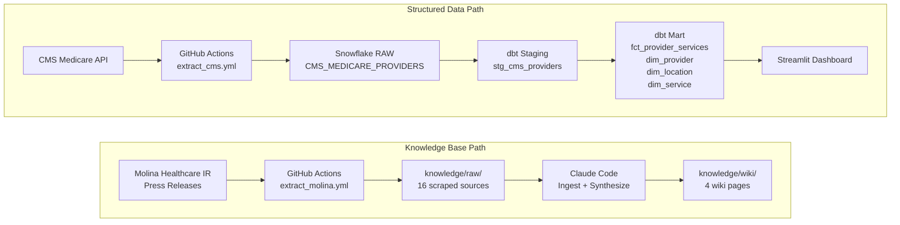
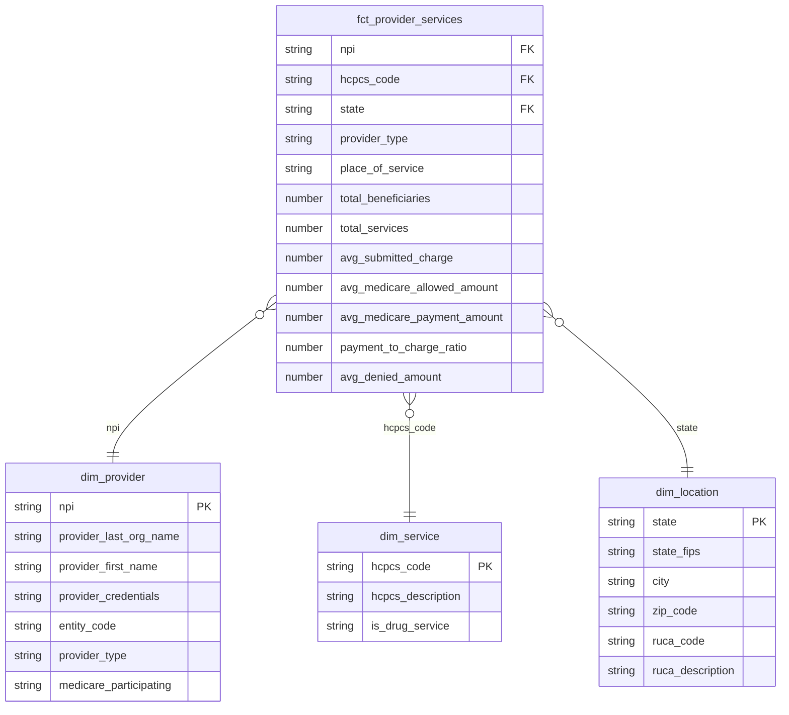

# Claims Analyst Healthcare

An end-to-end analytics engineering portfolio project targeting a Claims Data Analyst role at Molina Healthcare. The pipeline extracts CMS Medicare provider data via API, transforms it into a star schema using dbt, and surfaces claims payment analytics through a deployed Streamlit dashboard. A parallel knowledge base path scrapes and synthesizes Molina Healthcare financial reports and healthcare industry research using Claude Code.

## Job Posting

- **Role:** Analyst, Data
- **Company:** Molina Healthcare
- **Link:** [Molina Healthcare Careers](https://careers.molinahealthcare.com)

This project demonstrates SQL querying, dimensional modeling, pipeline automation, and data storytelling — the core skills listed in the posting's required experience.

## Tech Stack

| Layer | Tool |
|---|---|
| Source 1 | CMS Medicare Provider Utilization API (REST) |
| Source 2 | Molina Healthcare Investor Relations (Firecrawl web scrape) |
| Data Warehouse | Snowflake |
| Transformation | dbt |
| Orchestration | GitHub Actions (scheduled) |
| Dashboard | Streamlit |
| Knowledge Base | Claude Code (scrape → summarize → query) |

## Pipeline Diagram

## ERD (Star Schema)

## Dashboard Preview

**Live URL:** [https://claims-analyst-healthcare-dya29qdartt3znk4hmyrpy.streamlit.app](https://claims-analyst-healthcare-dya29qdartt3znk4hmyrpy.streamlit.app)

The dashboard has two tabs:
- **Descriptive:** Total services and average Medicare payments by state and provider type
- **Diagnostic:** Payment-to-charge ratio analysis, denied amounts by place of service, drug vs. non-drug payment gaps

## Key Insights

**Descriptive (what happened?):** Medicare service volume is heavily concentrated in a handful of states, with facility-based services generating significantly higher submitted charges than office-based care.

**Diagnostic (why did it happen?):** Drug services have a dramatically higher payment gap — submitted charges average 3–5x the Medicare payment amount — indicating that pharmaceutical billing is the primary driver of claim underpayment risk in this dataset.

**Recommendation:** Prioritize prior authorization and coding audits for drug-designated HCPCS codes billed in facility settings → projected reduction in underpayment exposure for high-volume specialty providers.

## Knowledge Base

A Claude Code-curated wiki built from 16 scraped sources across Molina Healthcare investor relations, CMS regulatory filings, and healthcare industry research. Wiki pages live in `knowledge/wiki/`, raw sources in `knowledge/raw/`. Browse `knowledge/index.md` to see all pages.

**Query it:** Open Claude Code in this repo and ask questions like:

- "What does my knowledge base say about healthcare claims denial rates?"
- "What are Molina Healthcare's recent financial trends and MCR performance?"
- "What technical skills does a Claims Data Analyst need?"

Claude Code reads the wiki pages first and falls back to raw sources when needed. See `CLAUDE.md` for the query conventions.

## Setup & Reproduction

**Requirements:** Python 3.11+, Snowflake trial account (AWS US East 1)

Copy `.env.example` to `.env` and fill in your credentials:

    SNOWFLAKE_ACCOUNT=
    SNOWFLAKE_USER=
    SNOWFLAKE_PASSWORD=
    SNOWFLAKE_DATABASE=
    SNOWFLAKE_SCHEMA=
    SNOWFLAKE_WAREHOUSE=
    FIRECRAWL_API_KEY=

Install dependencies:

    pip install -r requirements.txt

Run extractions:

    python extract/extract_cms_providers.py
    python extract/extract_molina_news.py

Run dbt:

    cd dbt_project
    dbt run
    dbt test

## Repository Structure

    .
    ├── .github/workflows/        # GitHub Actions pipelines (CMS + Molina)
    ├── dbt_project/
    │   └── models/
    │       ├── staging/          # stg_cms_providers + sources + schema tests
    │       └── mart/             # fct_provider_services, dim_provider, dim_location, dim_service
    ├── extract/                  # extract_cms_providers.py, extract_molina_news.py
    ├── streamlit_app/            # app.py + requirements.txt
    ├── knowledge/
    │   ├── raw/                  # 16 scraped sources
    │   └── wiki/                 # 4 Claude Code-generated wiki pages
    ├── docs/                     # proposal, job posting, brainstorm
    ├── .env.example
    ├── .gitignore
    ├── CLAUDE.md
    └── README.md
